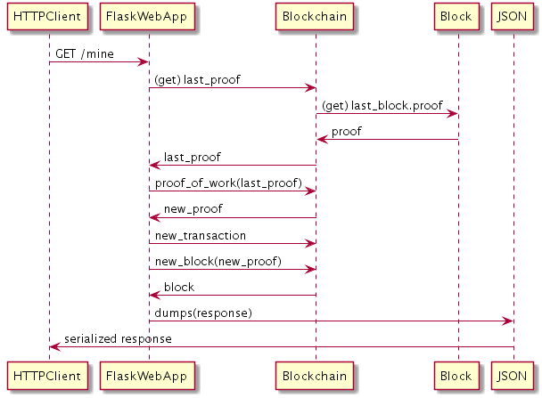

# A basic Blockchain Implementation in Python 

 


Advanced Software Engineering Pet Project
for the Data Sciences Master's Program at Beuth University of Applied Sciences, Berlin.

requirements: see requirements.txt

## Getting Started

These instructions will get you a copy of the project up and running on your local machine for development and testing purposes.

### Prerequisites

I worked with Python 3 and installed the following additional packages via anaconda.

```
conda install flask
conda install django
```

Furthermore I used Postman as HTTP client to interact with the Flask WebApp.

### Installing

Just clone / download this repository.

## Interacting with the Blockchain

I used Postman to interact with the Blockchain API over HTTP.

Start the Flask server:
```
$ python server.py

* Running on http://127.0.0.1:5000/ (Press CTRL+C to quit)
```

### Adding a transaction

Create a new transaction by making a POST request to
[http://localhost:5000/transactions/new]()
with a body containing our transaction structure, e.g.:
```
{
 "sender": "my address",
 "recipient": "someone else's address",
 "amount": 3
}
```


### Mining a block

Mine a block by making a GET request to [http://localhost:5000/mine]().


### Viewing the chain 

View the full chain by GET requesting [http://localhost:5000/chain]().


### Summing up all transactions

Obtain the total amount of all transactions by GET requesting [http://localhost:5000/sum]().


## Clean Code Development

Principles were applied according to (some, not all): 
* [http://clean-code-developer.de/die-grade/roter-grad/]()
* [http://clean-code-developer.de/die-grade/orangener-grad/]()

### Using a version control system 

Well, as you can see we're on GitHub here... 

### Apply simple refactoring patterns

#### Extract methods (DRY principle)

Instead of copy and pasting the code, I created the method mine_new_block() in [test_blockchain.py](./tests/test_blockchain.py), which is used several times within this class. 

### Rename cryptic names (scout rule)

An example for renaming cryptic names and thus applying the scout rule is [this commit](https://github.com/tripl3a/blockchain/commit/7fcebf465a8359312bd1650f62e2c18e257c0519) of test_blockchain.py. 

### Automated Integration/Unit Tests

Automated integration/unit tests have been implemented in [test_blockchain.py](./tests/test_blockchain.py)). 

Run them manually in terminal: 
```
py.test test_blockchain.py
```

### Single Responsibility Principle (SRP)

In [blockchain.py](./blockchain.py) the class Block simply represents a block and the class Blockchain manages the blockchain.
The code for the Flask WebApp is in a separate file [server.py](./server.py) 

## Continuous Delivery

[Travis-CI](https://travis-ci.org/tripl3a/blockchain) has been used as the tool for Continuous Integration.
The config file can be found [here][1] and the builds are located [here][2].

[1]: https://github.com/tripl3a/blockchain/blob/working-copy/.travis.yml
[2]: https://travis-ci.org/tripl3a/blockchain/builds

## Metrics

For metrics I used [Sonarcloud](https://sonarcloud.io/dashboard?id=tripl3a-github-token%3Aworking-copy).


## Aspect Oriented Programming & Functional Programming

The following requirements where solved by writing a Decorator:
* the use of higher order functions 
* functions as parameters and return values 
* use closures 
* AOP 

The decorator [@logger](https://github.com/tripl3a/blockchain/blob/b99daef56060f260d8c748d98a81a427dcb15620/blockchain.py#L69) is used in the class Blockchain to print console outputs 
before entering and after executing a (decorated) method. 
Using Decorators is also a way to add aspects to Python methods. (=> AOP)

Side effect free functions: 
* Example 1: [Blockchain.valid_proof()](https://github.com/tripl3a/blockchain/blob/b99daef56060f260d8c748d98a81a427dcb15620/blockchain.py#L158)
* Example 2: [Blockchain.proof_of_work()](https://github.com/tripl3a/blockchain/blob/b99daef56060f260d8c748d98a81a427dcb15620/blockchain.py#L141)

Anonymous functions: 

* In [Blockchain.total_transactions_amount()](https://github.com/tripl3a/blockchain/blob/b99daef56060f260d8c748d98a81a427dcb15620/blockchain.py#L172) a lambda function is used.

Only final data structures:

In Python there is no `final` keyword like in Java, which one can use to define constants.
You can achieve some similar semantic in by overwriting the attribute setter in the following way:
```
class WriteOnceReadWhenever:
    def __setattr__(self, attr, value):
        if hasattr(self, attr):
            raise Exception("Attempting to alter read-only value")

        self.__dict__[attr] = value
```
I implemented such a method in the Blockchain class to ensure that the `chain` attribute can't be overwritten. 

Anyway I didn't write any code that reuses/overwrites variables.

## Domain Specific Language

A small example for a DSL in Python can be found in a [separate git repository](https://github.com/tripl3a/dsl).

## UML

### Use case diagram


### Class diagram


### Sequence diagram for adding a transaction


### Sequence diagram for mining a block



### Sequence diagram for viewing the block chain


### State diagram


